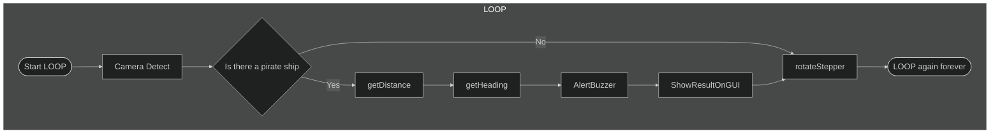

```mermaid
%%{init: {
  "theme": "dark",
  "themeVariables": {"fontSize":"20px"}
}
}%%

flowchart LR

subgraph LOOP
direction LR
LOOP_START([Start LOOP]) --> 
LOOP_detect[Camera Detect] --> LOOP_DEC_1{Is there a pirate ship}
LOOP_DEC_1 --> |No| LOOP_rotateStepper
LOOP_DEC_1 --> |Yes| LOOP_getDistance
LOOP_getDistance[getDistance] --> 
LOOP_getRotationAngle[getHeading] --> 
LOOP_alert[AlertBuzzer] --> 
LOOP_ShowResultOnGUI[ShowResultOnGUI] --> 
LOOP_rotateStepper[rotateStepper] --> 
LOOP_END([LOOP again forever])
end
```
