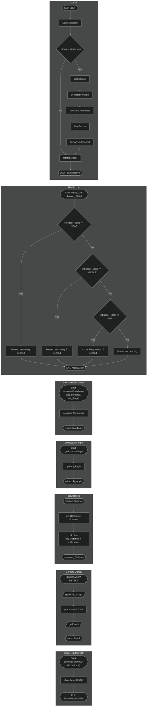

```mermaid
%%{init: {
  "theme": "dark",
  "themeVariables": {"fontSize":"20px"}
}
}%%

flowchart LR

subgraph ShowResultOnGUI
direction TB
ShowResultOnGUI_START(["Start ShowResultOnGUI (Coordinate)"]) --> 
ShowResultOnGUI_MAIN[showResultOnGUI] -->
ShowResultOnGUI_END(["End ShowResultOnGUI"])
end


subgraph Camera Detect
direction TB
CAMERA_DETECT_START([Start CAMERA DETECT]) --> 
CAMERA_DETECT_getImage[/get RGB_Image/] --> 
CAMERA_DETECT_processCNN[process with CNN] --> 
CAMERA_DETECT_getResult[/getResult/] --> 
CAMERA_DETECT_END([return Result])
end

subgraph getDistance
direction TB
getDistance_START([Start getDistance]) --> getDistance_getDurationfromUltrasonic[get Ultrasonic duration] --> getDistance_calculateDistance[calculate obj_Distance in millimeters] --> 
getDistance_END([return obj_Distance])
end


subgraph getRotationAngle
direction TB
getRotationAngle_START([Start getRotationAngle]) --> getRotationAngle_getRotationAngle[get obj_Angle] --> 
getRotationAngle_END([return obj_Angle])
end


subgraph calculateCoordinate
direction TB
calculateCoordinate_START(["Start calculateCoordinate (obj_Distance, obj_Angle)"]) -->
calculateCoordinate_calculate[calculate Coordinate] --> 
calculateCoordinate_END([return Coordinate])
end


subgraph AlertBuzzer
direction TB
AlertBuzzer_START(["Start AlertBuzzer (buzzer_State)"]) --> 
AlertBuzzer_Dec_NEAR{"if buzzer_State == NEAR"}

AlertBuzzer_Dec_NEAR --> |Yes| AlertBuzzer_NEAR[buzzer beep every second] --> AlertBuzzer_END
AlertBuzzer_Dec_NEAR --> |No| AlertBuzzer_Dec_MIDDLE{"if buzzer_State == MIDDLE"}

AlertBuzzer_Dec_MIDDLE --> |Yes| AlertBuzzer_MIDDLE[buzzer beep every 5 second] --> AlertBuzzer_END
AlertBuzzer_Dec_MIDDLE --> |No| AlertBuzzer_Dec_FAR{"if buzzer_State == FAR"}

AlertBuzzer_Dec_FAR --> |Yes| AlertBuzzer_FAR[buzzer beep every 10 second] --> AlertBuzzer_END
AlertBuzzer_Dec_FAR --> |No| AlertBuzzer_NONE[buzzer not beeping] --> AlertBuzzer_END

AlertBuzzer_END([END AlertBuzzer])
end


subgraph LOOP
direction TB
LOOP_START([Start LOOP]) --> 
LOOP_detect[Camera Detect] --> LOOP_DEC_1{Is there a pirate ship}
LOOP_DEC_1 --> |No| LOOP_rotateStepper
LOOP_DEC_1 --> |Yes| LOOP_getDistance
LOOP_getDistance[getDistance] --> 
LOOP_getRotationAngle[getRotationAngle] --> 
LOOP_calculateCoordinate[calculateCoordinate] --> 
LOOP_alert[AlertBuzzer] --> 
LOOP_ShowResultOnGUI[ShowResultOnGUI] --> 
LOOP_rotateStepper[rotateStepper] --> 
LOOP_END([LOOP again forever])
end
```
